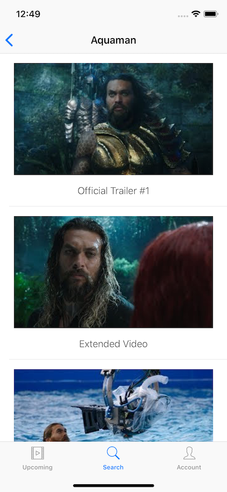
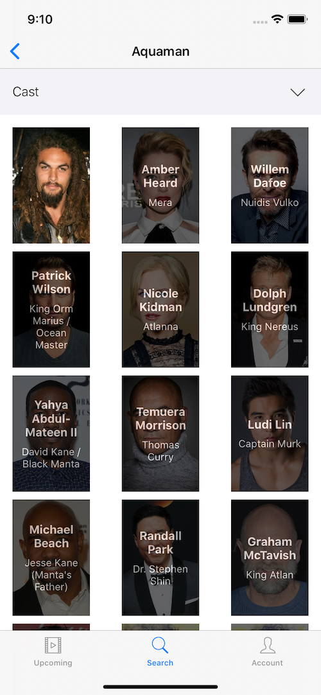
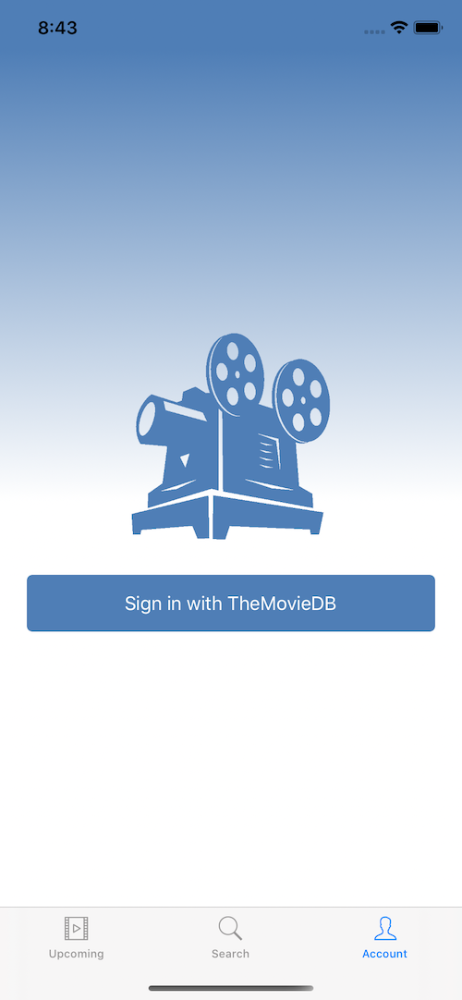

# Upcoming Movies App

Movies app written in Swift 5 using the Movie Database API.

# Screenshots

 
 
 
 
 
 

## Third-party libraries

### Kingfisher (https://github.com/onevcat/Kingfisher)
Used for downloading and caching images. In the app, it is used to show the poster and backdrop image of the movie.

### CollectionViewSlantedLayout (https://github.com/yacir/CollectionViewSlantedLayout)
Custom UICollectionViewLayout to display slanted content. In the app, it is used to present the list of favorite movies.

### KeychainSwift (https://github.com/evgenyneu/keychain-swift)
Helper functions for saving text in Keychain securely for iOS, OS X, tvOS and watchOS. In the app, it is used to save the Session Id and Account Id of the signed in user.

## Contributing

Feel free to open an issue or submit a pull request if you have any improvement or feedback.

## Author

Alonso Alvarez, alonso.alvarez.dev@gmail.com
