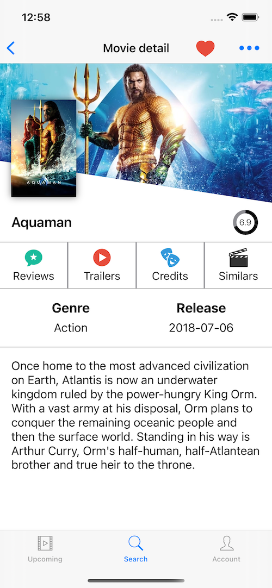
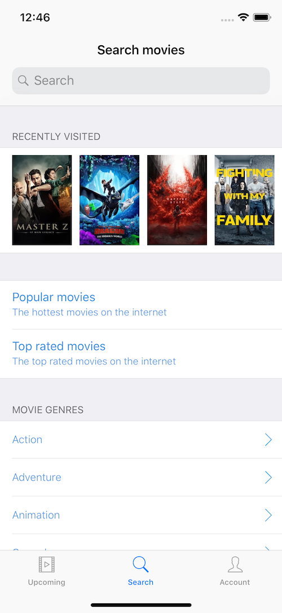
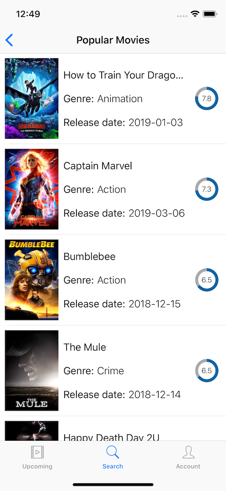

# Screenshots

 
 

# Upcoming Movies App

## Third-party libraries

### Kingfisher (https://github.com/onevcat/Kingfisher)
Used for downloading and caching images. In the app, it is used to show the poster and backdrop image of the movie.

## Author

Alonso Alvarez, alonso.alvarez.dev@gmail.com
