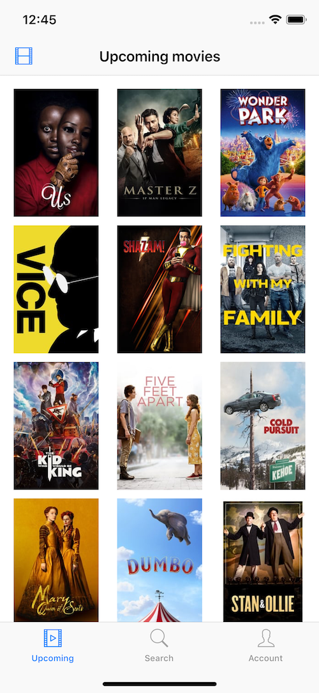
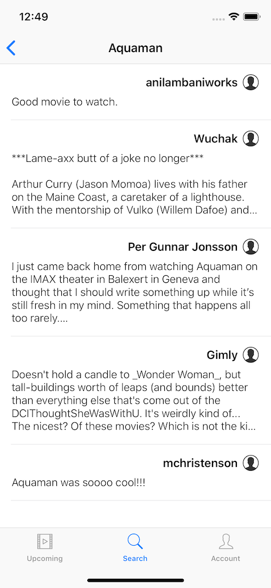
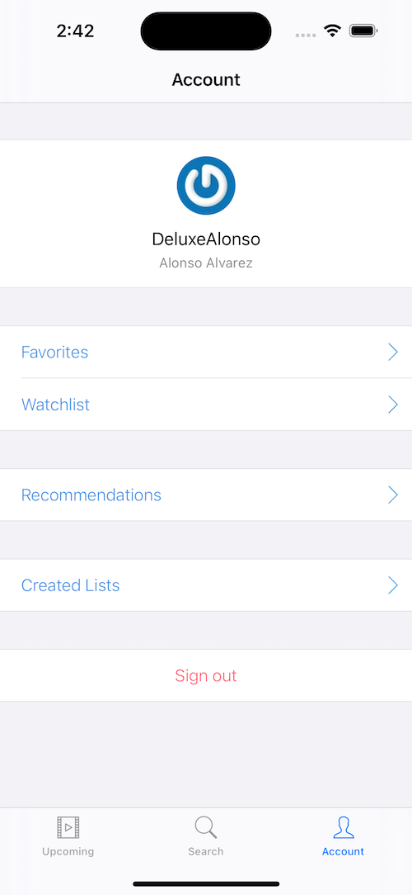
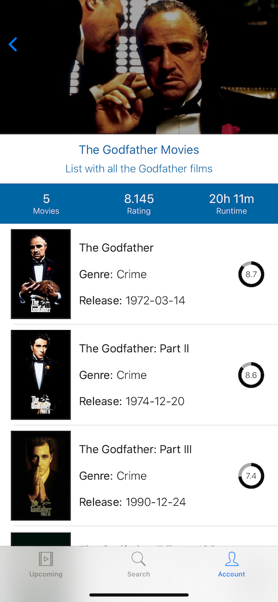
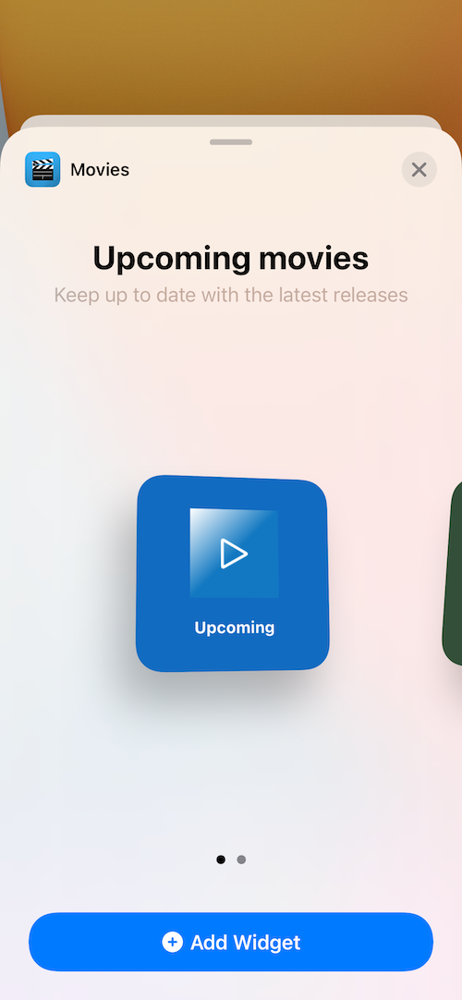

# Upcoming Movies App

Movies app written in Swift 5 using the TMDb API and demonstrating Clean Architecture, Dependency Injection, MVVM and Coordinators.

## Demo

## Screenshots

 
 
 
 
 
 
  

## How to run

### Requirements

1. Xcode 14.0+
2. Cocoapods 1.9.0+
3. Fastlane 2.1.0+ (only needed if you want to run the unit tests and swift lint scans via the CLI).

### Getting started

1. Clone this repository.
2. Via the CLI, go to the root folder of the project where Podfile is located and run `pod install`.
3. Open the workspace file and you are ready to go.

*Note: you can run the tests either using `CMD+U` on Xcode or running `fastlane tests` via the CLI.* 

## First-party libraries

### DLProgressHUD (https://github.com/DeluxeAlonso/DLProgressHUD)
Lightweight Progress HUD implementation for iOS.

## Third-party libraries

### Kingfisher (https://github.com/onevcat/Kingfisher)
Used for downloading and caching images. In the app, it is used to show the poster and backdrop image of the movie.

### CollectionViewSlantedLayout (https://github.com/yacir/CollectionViewSlantedLayout)
Custom UICollectionViewLayout to display slanted content. In the app, it is used to present the list of favorite movies.

### KeychainSwift (https://github.com/evgenyneu/keychain-swift)
Helper functions for saving text in Keychain securely for iOS, OS X, tvOS and watchOS. In the app, it is used to save the Session Id and Account Id of the signed in user.

### SwiftLint (https://github.com/realm/SwiftLint)
A tool to enforce Swift style and conventions.

### Swinject (https://github.com/Swinject/Swinject)
Dependency injection framework for Swift.

## Contributing

Feel free to open an issue or submit a pull request if you have any improvement or feedback.

## Author

Alonso Alvarez, alonso.alvarez.dev@gmail.com
